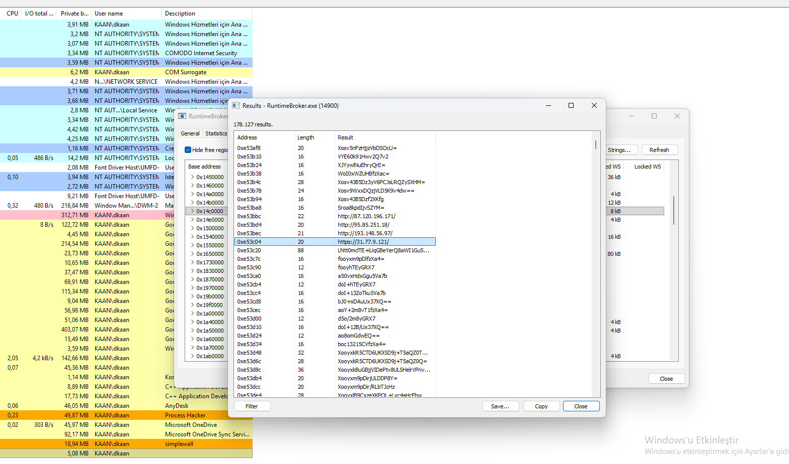
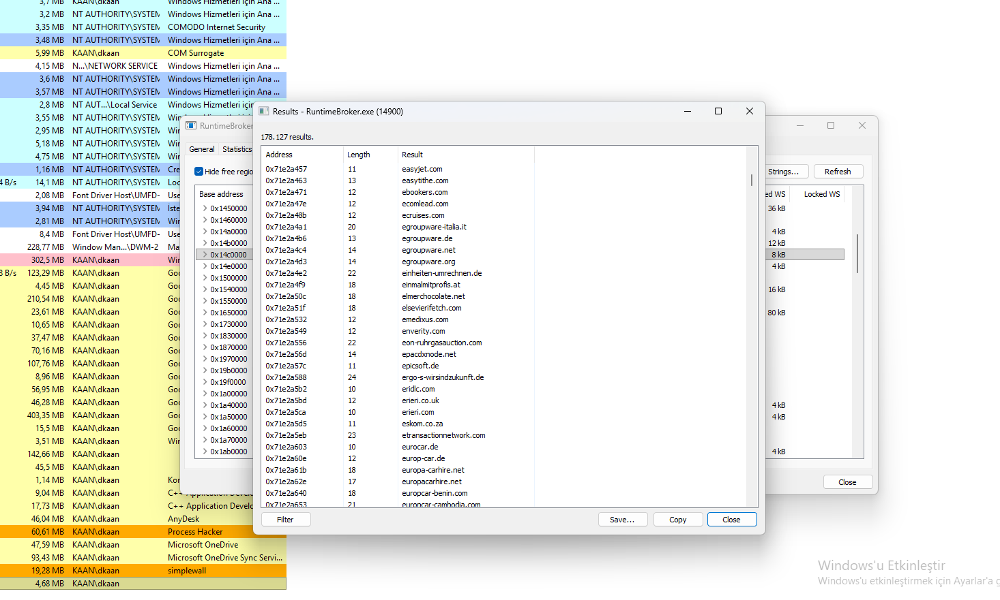
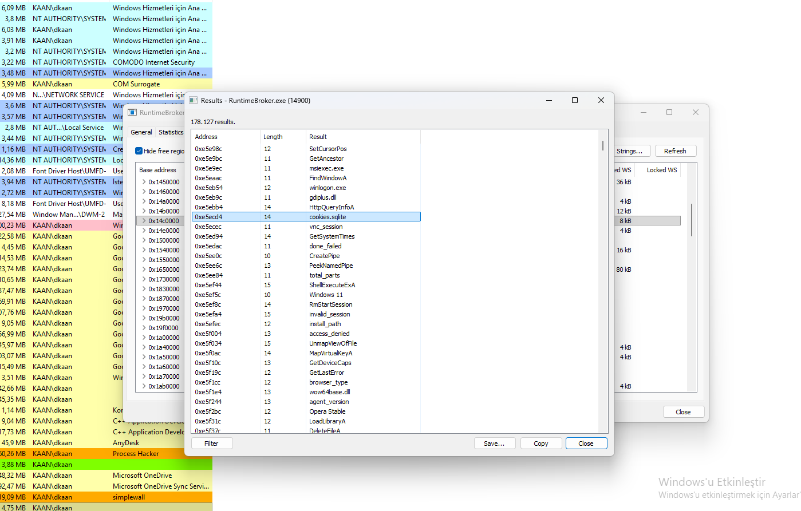
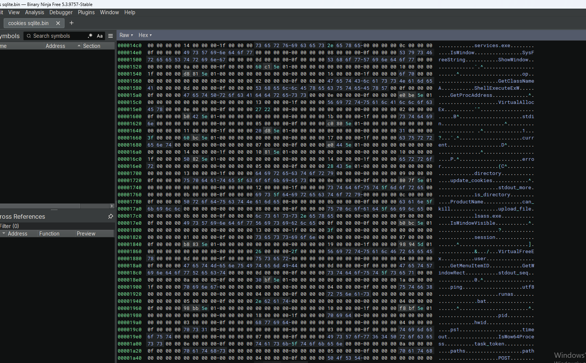
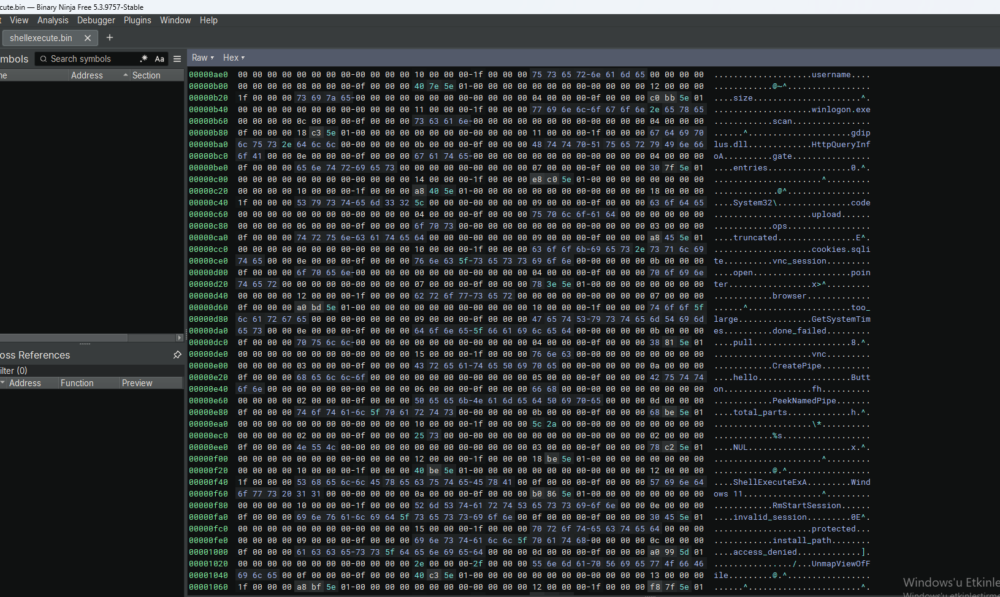

## 1. RuntimeBroker.exe Hollowing & C2 IP Addresses

Process Hacker memory analysis reveals that StealC Stealer performs process hollowing on `RuntimeBroker.exe` and establishes connections to multiple C2 servers.

### Key Observations:

- **Target Process:** `RuntimeBroker.exe` (PID 14900).
- **C2 IP Addresses:**
  - `http://87.120.196.171/`
  - `http://95.85.251.18/`
  - `http://193.148.56.97/`
  - `https://31.77.9.121/`
- **Base64 Strings:** Multiple Base64-encoded strings (likely encrypted configuration data).

### Why This Matters:

- **Process Hollowing:** The malware injects its payload into a trusted Windows process.
- **Multiple C2 Servers:** Redundancy ensures communication even if one server is blocked.
- **Data Exfiltration:** The IP addresses are likely used to send stolen data.

### Visual Reference:

*Process Hacker view showing RuntimeBroker.exe strings with C2 IP addresses.*

## 2. C2 Domain List – StealC Stealer

Process Hacker memory analysis reveals an extensive list of C2 domains used by StealC Stealer for data exfiltration and command delivery.

### Key Domains Observed:

- **`easyjet.com`** – C2 domain.
- **`easythe.com`** – C2 domain.
- **`ebookers.com`** – C2 domain.
- **`ecomlead.com`** – C2 domain.
- **`ecruises.com`** – C2 domain.
- **`egroupware-italia.it`** – C2 domain.
- **`egroupware.de`** – C2 domain.
- **`egroupware.net`** – C2 domain.
- **`egroupware.org`** – C2 domain.
- **`einheiten-umrechnen.de`** – C2 domain.
- **`einmalmitprofits.at`** – C2 domain.
- **`elmerchocolate.net`** – C2 domain.
- **`elsevierfctch.com`** – C2 domain.
- **`emedixus.com`** – C2 domain.
- **`enverity.com`** – C2 domain.

### Why This Matters:

- **Redundancy:** Multiple domains ensure the malware remains operational if some are blocked.
- **Evasion:** Legitimate-looking domains (e.g., `easyjet.com`) help avoid detection.
- **Exfiltration:** Stolen data is sent to these domains.

### Visual Reference:

*Process Hacker view showing C2 domains used by StealC Stealer.*

## 3. Cookie Theft & System Manipulation

Process Hacker memory analysis of `RuntimeBroker.exe` reveals that StealC Stealer targets browser cookies and uses system manipulation APIs.

### Key Strings Observed:

- **`cookies.sqlite`** – Targets browser cookie databases (Firefox).
- **`ShellExecuteExA`** – Executes programs or opens files.
- **`GetSystemTimes`** – Retrieves system timing information.
- **`wow64base.dll`** – 32-bit compatibility layer (evasion).
- **`agent_version`** – Malware version identifier.
- **`browser_type`** – Identifies targeted browser.
- **`FindWindowA`** – Locates windows (UI interaction).
- **`CreatePipe`** – Creates pipes for inter-process communication.
- **`LoadLibraryA`** – Loads additional DLLs.

### Why This Matters:

- **Cookie Theft:** `cookies.sqlite` confirms cookie data theft.
- **System Manipulation:** `ShellExecuteExA` and `CreatePipe` indicate command execution.
- **Evasion:** `wow64base.dll` helps bypass 64-bit security controls.

### Visual Reference:

*Process Hacker view showing `cookies.sqlite`, `ShellExecuteExA`, and other system APIs.*

## 4. cookies.sqlite – API & System Manipulation

Binary Ninja analysis of the `cookies.sqlite` file reveals a list of API calls and system functions used by StealC Stealer.

### Key APIs Observed:

- **`GetClassNameA`** – Retrieves window class names (UI interaction).
- **`ShellExecuteExW`** – Executes programs or opens files.
- **`VirtualAlloc`** – Allocates memory (injection).
- **`VirtualFree`** – Frees memory (cleanup).
- **`GetMenuItemID`** – Retrieves menu item IDs (UI manipulation).
- **`IsWow64Process`** – Detects 32-bit process on 64-bit OS (evasion).
- **`upload_file`** – Uploads stolen data to C2.
- **`update_cookies`** – Updates cookie data (persistence).

### Why This Matters:

- **System Manipulation:** `ShellExecuteExW` and `VirtualAlloc` enable code execution.
- **Evasion:** `IsWow64Process` helps bypass 64-bit security.
- **Data Exfiltration:** `upload_file` confirms data theft.

### Visual Reference:

*Binary Ninja view showing `ShellExecuteExW`, `VirtualAlloc`, and other APIs in `cookies.sqlite`.*

## 5. ShellExecuteEx – System & Data Theft

Binary Ninja analysis of the `ShellExecuteEx` function reveals a list of system processes, C2 communication functions, and data theft APIs used by StealC Stealer.

### Key Strings Observed:

- **`winlogon.exe`** – Targets the Windows logon process (privilege escalation).
- **`vdrsvc.exe`** – Targets a service process (evasion).
- **`HttpQueryInfoA`** – Retrieves HTTP headers (C2 communication).
- **`cookies.sqlite`** – Targets browser cookies (data theft).
- **`vncdll`** – VNC-related DLL (remote access).
- **`PeekNamedPipe`** – Reads data from named pipes (IPC).
- **`VirtualFree`** – Frees memory (cleanup).
- **`UnmapViewOfFile`** – Unmaps files (cleanup).
- **`GetSystemTimes`** – Retrieves system times (anti-debug).

### Why This Matters:

- **Privilege Escalation:** `winlogon.exe` is a high-value target.
- **C2 Communication:** `HttpQueryInfoA` is used for HTTP-based C2.
- **Data Theft:** `cookies.sqlite` confirms cookie theft.
- **Evasion:** `vdrsvc.exe` and `GetSystemTimes` help avoid detection.

### Visual Reference:

*Binary Ninja view showing `winlogon.exe`, `HttpQueryInfoA`, `cookies.sqlite`, and other APIs.*

## Conclusion

This analysis uncovered **StealC Stealer**, a sophisticated info-stealer that uses process hollowing on `RuntimeBroker.exe`, multiple C2 servers, and extensive data theft capabilities.

### Key Takeaways:

- **Process Hollowing:** Injects into `RuntimeBroker.exe` (PID 14900).
- **C2 Infrastructure:** Multiple IPs (`87.120.196.171`, `95.85.251.18`, `193.148.56.97`, `31.77.9.121`) and domains (`easyjet.com`, `ebookers.com`, `ecomlead.com`, etc.).
- **Cookie Theft:** Targets `cookies.sqlite` for browser cookie data.
- **System Manipulation:** Uses `ShellExecuteExA`, `VirtualAlloc`, `IsWow64Process`, and `GetSystemTimes`.
- **Data Exfiltration:** `upload_file` and `update_cookies` for sending stolen data.

### Detection Recommendations:

- Block C2 IPs: `87.120.196.171`, `95.85.251.18`, `193.148.56.97`, `31.77.9.121`.
- Block C2 domains: `easyjet.com`, `ebookers.com`, `ecomlead.com`, etc.
- Monitor for `cookies.sqlite` access from unusual processes.
- Detect `ShellExecuteExA` and `VirtualAlloc` calls in `RuntimeBroker.exe`.

### Sample Download

The analyzed StealC Stealer sample is available on MalwareBazaar for those who wish to conduct their own analysis:

🔗 **[StealC Stealer Sample on MalwareBazaar](https://bazaar.abuse.ch/sample/05dbb515120ec8a6a453c91833eacf432e67ffe89fd650ac704eefc6bf8de290)**

**Tools Used:** Process Hacker, Binary Ninja, x64dbg
